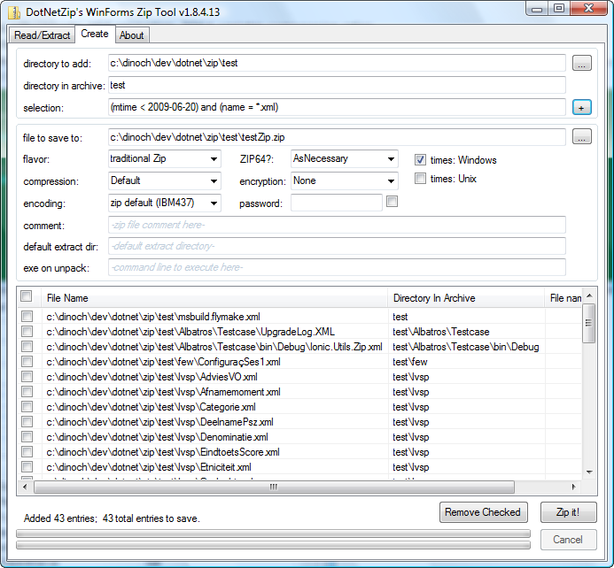

# DotNetZip - migrated repo


This repo is now read-only. It is preserved as a read-only archive of the DotNetZip ource code.
The latest code is available [here](https://github.com/DinoChiesa/DotNetZip-2025). 


# DotNetZip - Zip and Unzip in C#, VB, any .NET language
DotNetZip is a FAST, FREE class library and toolset for manipulating zip files. Use VB, C# or any .NET language to easily create, extract, or update zip files.

DotNetZip is the best open-source ZIP library for .NET. Just look at the reviews! 


DotNetZip works on PCs with the full .NET Framework, and also runs on mobile devices that use the .NET Compact Framework. Create and read zip files in VB, C#, or any .NET language, or any scripting environment. DotNetZip supports these scenarios:
- a Silverlight app that dynamically creates zip files.
- an ASP.NET app that dynamically creates ZIP files and allows a browser to download them
- a Windows Service that periodically zips up a directory for backup and archival purposes
- a WPF program that modifies existing archives - renaming entries, removing entries from an archive, or adding new entries to an archive
- a Windows Forms app that creates AES-encrypted zip archives for privacy of archived content.
- a SSIS script that unzips or zips
- An administrative script in PowerShell or VBScript that performs backup and archival.
- a WCF service that receives a zip file as an attachment, and dynamically unpacks the zip to a stream for analysis
- an old-school ASP (VBScript) application that produces a ZIP file via the COM interface for DotNetZIp
- a Windows Forms app that reads or updates ODS files
- creating zip files from stream content, saving to a stream, extracting to a stream, reading from a stream
- creation of self-extracting archives.

If all you want is a better DeflateStream or GZipStream class to replace the one that is built-into the .NET BCL, DotNetZip has that, too. DotNetZip's DeflateStream and GZipStream are available in a standalone assembly, based on a .NET port of Zlib. These streams support compression levels and deliver much better performance than the built-in classes. There is also a ZlibStream to complete the set (RFC 1950, 1951, 1952). 

And the price for all this: totally FREE.

### Example Usage
Here's some C# code that creates a zip file.
```
 using (ZipFile zip = new ZipFile())
 {
     // add this map file into the "images" directory in the zip archive
     zip.AddFile("c:\\images\\personal\\7440-N49th.png", "images");
     // add the report into a different directory in the archive
     zip.AddFile("c:\\Reports\\2008-Regional-Sales-Report.pdf", "files");
     zip.AddFile("ReadMe.txt");
     zip.Save("MyZipFile.zip");
 }
```

Here is some VB code that unpacks a zip file (extracts all the entries):
```
  Dim ZipToUnpack As String = "C1P3SML.zip"
   Dim TargetDir As String = "C1P3SML"
   Console.WriteLine("Extracting file {0} to {1}", ZipToUnpack, TargetDir)
   Using zip1 As ZipFile = ZipFile.Read(ZipToUnpack)
       AddHandler zip1.ExtractProgress, AddressOf MyExtractProgress
       Dim e As ZipEntry
       ' here, we extract every entry, but we could extract
       ' based on entry name, size, date, etc.
       For Each e In zip1
           e.Extract(TargetDir, ExtractExistingFileAction.OverwriteSilently)
       Next
   End Using
```

More code:
See the examples , for VB, C#, Powershell, and so on.
Read ODS files in C# (external article)
Creating a zip in ASP.NET (external article by Scott Mitchell)
Use DotNetZip in SSIS (external blog)


## More Information
DotNetZip is a 100% managed code library that can be used in any .NET application - Console, Winforms, WPF, ASP.NET, Sharepoint, Web services apps, and so on. New for v1.9.1.6: Silverlight. It can also be used from scripting environments or COM-capable environments like Powershell scripts, VBScript, VBA, VB6, PHP, Perl, Javascript, and more. Whatever environment it is used from, DotNetZip produces zip files that are fully interoperable with Windows Explorer, as well as Java applications, apps running on Linux. 

It is designed to be simple and easy to use. DotNetZip is packaged as a single DLL, about 400k in size. It has no third-party dependencies. It is Medium Trust, so can be used on most hosters. Get zipping just by referencing the DLL. The library supports zip passwords, Unicode, ZIP64, stream input and output, AES encryption, multiple compression levels, self-extracting archives, spanned archives, and more.

[Info on Getting Started with DotNetZip in Visual Studio](./docs/GettingStarted-VisualStudio.md).

The release includes the library, as well as some sample applications (with source) showing how to use the library. This is a look at the WinForms sample app that creates and zip files. It serves as my free replacement for the $29 WinZip tool:



If you find DotNetZip useful, consider donating. I am accepting donations.

[Background and Details](Background-and-Details.md)

## Frequently Asked Questions

### How does this Zip Library work?
DotNetZip is packaged as a single DLL, a single assembly. It is fully managed code, written in C#, and provides support for reading and writing Zip archive files and streams. The main type is ZipFile, featuring methods like Add(), Extract() and Save(). There are string and int indexers for the entries of the ZipFile. There are properties for things like password protection, unicode and codepage support, and ZIP64 behavior. And there are progress events for Reading, Saving, and Extracting.

### What do I need, in order to be able to create and read zip files from within my application using this library?
To use the zip capability in your applications, you need to be using the .NET Framework 2.0 or later, and you need the DotNetZip Devkit assembly. You do not need to download the sourcecode of DotNetZip in order to use it. You can simply download the binary.

You can use the Zip library from any application, whether a console application, a Windows-Forms application, a server-based application like an ASP.NET page, a smart-device app, a Windows Service, a Silverlight app, or something else. You can use C#, VB.NET, COBOL.NET, IronPython, IronRuby, F#, or any other .NET language. You can also use COM environments, like ASP pages, Javascript, PHP, and others. To build your application, you can use the full version of Visual Studio, or one of the Visual Studio Express tools, or just a text editor.

### What if I just want to use the graphical tool?
No problem. Just download the Utils zip or MSI from the latest releases tab, and you will get an easy-to-use fully-functional ZIP creation and extraction tool, a free functional-equivalent replacement for WinZip. It supports all the DotNetZip capability, like SFX, AES, ZIP64, arbitrary Code Pages, Unicode, zip comments, file and entry selection, spanned or segmented zips, and more.

### What do I need to build this library from the source?
You need the .NET Framework SDK v3.5, or later; or, Visual Studio 2008 or later. While the library is usable by .NET 2.0 and later, to build it you need .NET 3.5 or later. This is because the source code uses features that were introduced in the C# v3.0 compiler, vars and array initializers and so on. The .NET 3.5 SDK is available here. I don't know if the library will build in Visual C# Express 2008; I never tried it. It should. 

### Is this thing supported on Mono/Linux?
It's not supported at all. But, it apparently works on Mono/Ubuntu. I don't test it that way. If you'd like to volunteer, let me know. 

### How big is the library?
As of version 1.9, the Ionic zip DLL is about 400k in size. The capability to produce self-extracting archives is optional, and amounts to about 200k of that. (there is a "Reduced" build of the library in the Devkit download, for those who are counting kilobytes). The Compact-Framework version of the library is about 130k. There is just one DLL. There is no other pre-requisite. 

### Why would you want to produce yet another Zip Library?
There are a number of options in the .NET world for manipulating zip files. Some are commercial libraries, some are open-source. You can even shoe-horn the System.IO.Packaging API, which is included in .NET 3.0, into a zip library. But there are tradeoffs for all of them. Some people are willing to give up commercial support for a lower price. Some people don't like the GPL. Some of those other packages are complex to use for zip files. Some of them don't have enough features (Eg, AES encryption, ZIP64, zip spanning). Some are too slow. What I found is that most people want something simple and easy to use, that works well, has good features, compresses effectively and fast, and is the right price. DotNetZip is that option. It's fast, it's simple, it's free.

### Does this library make self-extracting zip files? 
Yes. It can make self-extracting zip files or standard zip files. The self-extracting archives can either be Windows (GUI) apps or command-line applications. The self-extractors require .NET 2.0 on the computer doing the extraction.

### Does this library read self-extracting zip files? 
Yes. DotNetZip can read self-extracting archives (SFX) generated by WinZip, and WinZip can read SFX files generated by DotNetZip. 

### Are the zip files this library makes compatible with the Java.util.zip classes in the Java class library? 
Yes. This library makes standard zip files. If you use some advanced features not supported by the built-in Java library, like AES encryption or ZIP64 or spanning, then the zip files won't be readable by Java. This is a shortcoming in the Java library, not in DotNetZip. 

### If I create a zipfile with this library, can I open it from within a Java/PHP/Python/C/Perl application? From within WinRar/WinZIP?
Yes. This library makes standard zip files, so anything that can read and write zip files, on any platform, can work with zipfiles generated from this library. In Java, you would use the java.util.zip library. In Python, you would use the zipfile module. Not all languages and environments support all ZIP features. For example, currently the Java library does not do ZIP64, and the zipfile module in Python does not support zipfile comments, while DotNetZip can create and read zip archives using those features. When mixing platforms, you need to be careful with interop testing. If you don't know what these features are, you probably don't need them and you won't run into interop problems. 

### If I create a zipfile with a java/PHP/Python/C/Perl application, or with WinRar/WinZip/7zip, can I open it from within a .NET application, using this library?
Yes. This library reads compliant zip files. 

### Can I use the library from within VBScript, PHP, Perl, Javascript, or VB6?
Yes, the library is ComVisible. A PHP script running on Windows can use the library to dynamically create an AES-encrypted zip file for download, for example. A .vbs script can extract files. An ASP page can create a zip file. There is sample code in the help file, and in the source distribution, covering all these. 

### Can I use Windows Explorer to open the zip files that this library creates, and vice versa?
Yes. This library reads and writes standard zip files. If you use extensions to the ZIP spec not supported by Windows, like ZIP64 or spanning or AES encryption, Windows Explorer will not be able to extract the files. 

### Can I use the Archive Utility on MacOS to or Stuffit open the zip files that this library creates, and vice versa?
Yes. This library reads and writes standard zip files. You may have to follow a format convention for the zip file. 

### Does the library work with applications that depend on the .NET Compact Framework?
Yes. DotNetZip is built for the .NET Compact Framework (v2.0) as well as for the regular .NET Framework. You can build a Smart Device application in Visual Studio 2008, that uses the capabilities of DotNetZip. 

### Is there a version of the library built to work with Silverlight applications?
Yes. New for v1.9.1.6, in July 2011, DotNetZip is built for Silverlight. 

### Does the library support zero-length zip entries, zipfile comments, zip entry comments, zipping up empty directories, recursive directory traversal, zipping up selected files by filename (with wildcards), and password-protecting entries? 
Yes. 

### Does the library handle ZIP64?
Yes. The original ZIP specification allowed up to 65535 entries in a zip archive, and archive and entry sizes up to 4.2g. The ZIP64 extensions raise those restrictions, at the expense of compatibility and interoperability. DotNetZip can read or write "standard" zip files or ZIP64 zip files. 

### Does the library do AES 128 or 256 encryption?
Yes. DotNetZip's AES encryption is compatible with the WinZip AES-encryption extension to the PKWare ZIP specification. DotNetZip uses the same FIPS-197 compliant data format and approach. If you create an AES-encrypted ZIP file with DotNetZip, you will be able to view it and extract it in WinZip, and vice versa. Also, DotNetZip's AES will work with any other tool that is compatible with WinZip. NB: If you open an AES-encrypted ZIP file in Windows Explorer, whether generated by DotNetZip or some other tool, you will be able to view the list of files, but you won't be able to extract entries. Also, AES encryption is not available in Silverlight. 

### Can an application that uses this library make a self-extracting, AES-encrypted, Unicode, ZIP64 zip file? 
Yes, if you want to, you can do that.

### Does this library support any compression algorithm other than deflate?
No. Entries are either Stored or Deflated. 

### Can the library read or create "Split" zip files?
Yes. This was added in v1.9. 

### Does this library use System.IO.Compression.DeflateStream for the DEFLATE capability?
No. In earlier versions, it did. But the DeflateStream built-into the .NET Framework BCL exhibits anomalous compression behavior on previously compressed data, like mp3 or jpg files. DotNetZip includes a managed compression library, based on ZLIB. It's fast, fully DEFLATE compliant, and it compresses better than the built in version! And, the DeflateStream that is included in DotNetZip is available for any application to use, under the same terms as the rest of the DotNetZip library. 

### Why would a developer not just use the Packaging APIs included in the .NET Framework 3.0?
The Packaging APIs are optimized for producing .docx files and .xlsx files. This library is generally simpler and faster for creating or reading plain, generic zipfiles. This library supports ZIP features like ZIP64 or AES or split archives; the Packaging API does not. DotNetZip provides nice features like progress events and file selectors; the Packaging API does not.

### Why would a developer not just use the ZIP capability that is built into the Windows Shell?
For the same kinds of reasons. The programming model for managed code apps is much nicer with DotNetZip, and DotNetZip is faster. The advanced features, for things like selecting entries from the zip file, or AES-encryption, or self-extracting archives, are not available using the shell library.

### Does the library support reading or writing encrypted or password protected zip files?
Yes, this library helps applications read and write zip files that use passwords to protect the entries in the zip archive. Either PKZIP ("weak") encryption or WinZip-compatible AES encryption.

### Does the library support the BZIP2 compression method within ZIP files?
Yes. This feature is new for v1.9.1.6.


### Can Windows Explorer ("compressed folders") read and extract the zip files created by this library if the zip has password protection?
Yes. It just works.

### Can I use the DotNetZip library to read .docx files, .xslx files?
Yes. They are just zip files. Some people use DotNetZip on Mono to produce or edit .xlsx or .docx files. Keep in mind, the Packaging APIs included in .NET 3.0 are optimized for producing .docx files and .xlsx files. 

### Does the library support Unicode filenames and comments?
Yes, the library can create and read zip files that have Unicode (UTF-8) filenames and comments. You can also specify arbitrary code pages when reading or writing zipfiles. But, Windows Explorer does not support UTF-8 encoded zip files. To read the zip you create, you will have to use a tool or library that supports unicode, such as WinRar, DotNetZip, etc.

### Can the library be used to read a zip file that has entries with filenames containing Chinese characters, produced by WinRAR?
Yes. To do this you would specify the "big5" code page (cp 950) when reading the zip. In addition to Chinese, it can handle any code page.

### What about reading and writing zip files with other languages and code pages? Portugese? Hebrew? Arabic? Greek? Cyrillic? Norwegian? Finnish? etc?
Yes. Just specify the appropriate code page when reading or writing the zip archive. 

### Can Windows Explorer ("compressed folders") read the zip files created by this library if the zip has entries with Unicode-encoded filenames?
No. But that is a limitation of Windows XP and Windows Vista. It is not a limitation of this library. 

### Can DotNetZip read or write RAR files?
No. DotNetZip does zip files. 

### Can WinRAR read the zip files produced by DotNetZip?
Yes. But remember, DotNetZip does not produce RAR files. DotNetZip produces ZIP files. WinRAR can read ZIP and RAR files, I believe.

### Is there documentation for the library?
Yes, there is a CHM file in MSDN helpfile format, generated from the xml comments in the code. All the public interfaces are thoroughly documented. There are tons of code examples in the doc. You can view the CHM online

### I cannot view the CHM documentation. The error is: "This program cannot display the webpage." or, "The address is invalid." Is there an error with the chm file?
No, there is no problem with the CHM file. You have likely encountered a problem with Windows protection of files downloaded from less trusted locations. To view the chm file, within Windows Explorer, right-click on the CHM file, select properties, and Unblock it (button in lower part of properties window).

### Does the library support zipping to a stream? Or unzipping from a stream?
Yes, you can zip up files and Save the zip archive to a stream. As well you can Read a zip archive from an open stream - I use this for embedded resources in apps: I call GetManifestResourceStream(), and then unzip that resource. Reading and writing streams complements the capability of being able to Save to a plain file or read from a plain file. The Save-to-a-stream capability allows you to write a zip archive out to, for example, the ASP.NET Response.Output stream, without creating an intermediate file. Very nice for ASP.NET applications.

### Ok, the library can write a zip archive to a stream, and read a zip from a stream, But... can the library add an entry to a zipfile, reading content from a stream? can the library unzip a single entry into a stream? Can an application read an entry as a stream?
Yes. Yes. Yes. Unlike some other libraries, in most cases DotNetZip handles the streaming; your application does not need to implement a Read/Write data pump. The application needs only to open the streams. Using the stream support, you could, for example, open a zip archive, and then modify the files in the archive, and Save out to a Response.OutputStream in ASP.NET, without ever writing a file to the disk. All the zip file content can be manipulated in memory (using MemoryStream for example). 

### Does this library allow removal of entries from zip files, or updating of entries in zip files?
Yes.

### Do I have to write programs to take advantage of this thing? or is there some other way I can take advantage of the DotNetZip?
Typically people will embed this DLL into an application. But, the DotNetZip downloads includes a package of utility applications: A Windows GUI tool, and a set of command-line tools that utilize the library, that you can use out of the box to zip and unzip. I drop these in my own bin directory and it allows me to zip and unzip from the command line or from batch files. Also, you can take advantage of the DotNetZip library from within Powershell, if that is your bag. Creating or extracting zips within a script is pretty handy. 

### Can I embed the source for DotNetZip into my own project?
Yes - that's allowed by the license. But you may want to think about just redistributing the binary DLL - it is a much easier option. 

### Can I distribute the binary DLL with my own project?
Yes - that's allowed by the license.

### What's the mainstream approach for using DotNetZip in a 3rd party app?
The mainstream approach is to distribute the binary DLL with your own app.

### What if I want to use DotNetZip in my app, but I don't want to distribute it as a separate DLL?
You have options. The most mainstream and generally easiest way to embed DotNetZip into your application is to redistribute the DLL. But if you don't want to do that, there are alternatives. One option is to embed the source for DotNetZip into your own project. This may seem like the obvious approach, but it is probably not what you want, unless you really need to modify the source of DotNetZip. A better approach is to merge the DLL into your EXE, with ILMerge: http://www.microsoft.com/downloads/details.aspx?familyid=22914587-b4ad-4eae-87cf-b14ae6a939b0&displaylang=en This works with your app regardless of what language it uses, whether it is a Winforms app, a WPF app, a service, etc. A final option is to embed the DLL as a resource into your application, and provide an AssemblyResolve event that reads the DLL from the resource stream. Which option you choose depends on your requirements.
